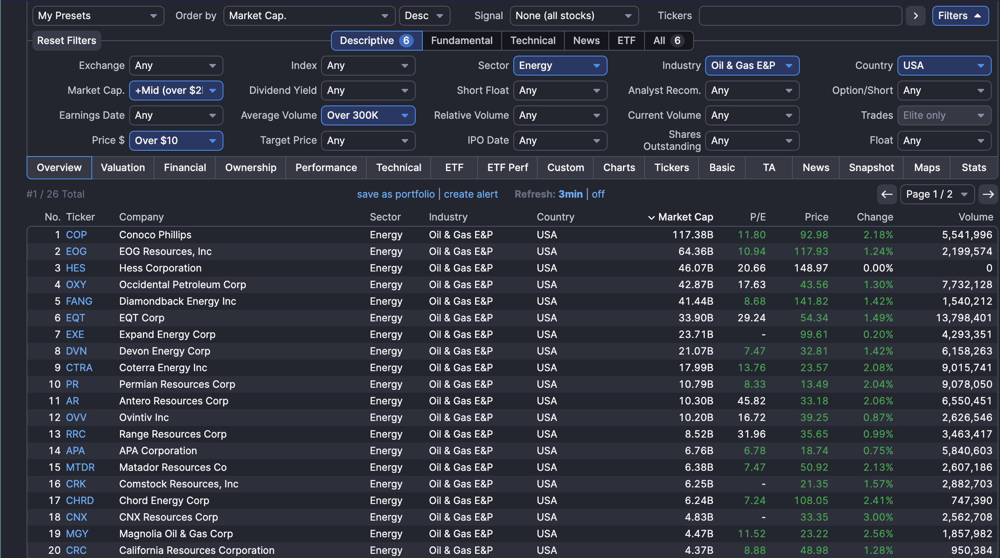

# The Energy Sector

Energy sector refers to companies involved in production , distribution and servicing of the energy resources. This include

-Fossil Fules 
-Nuclear Energy
-Renewable Energy 
-Infrastructure Companies 
-Equipment Providers and servicers

A classification system to understand the heirarchy is used called GICS ( Global Industry Classification Standard) developed my MSCI ( Morgan Stanley Capital International) and S&P (  Standard and Poor's) in 1999. It is now the most widely used classifying system for publically traded equities worldwide.

GICS is heirarchical

| Level                         | Description                  | Example                            |
| ----------------------------- | ---------------------------- | ---------------------------------- |
| **Sector (2 digits)**         | Broad economic segment       | 10 – Energy                        |
| **Industry Group (4 digits)** | Subdivision of sector        | 1010 – Energy Equipment & Services |
| **Industry (6 digits)**       | More specific categorization | 101010 – Oil & Gas Drilling        |
| **Sub-Industry (8 digits)**   | Most granular level          | 10101010 – Offshore Drilling       |


To give you an idea, there are : 

11 sectors
24 industry groups
69 industries
158 sub-industries


Our Focus is on Energy, so here is energy sector broken down using the GICS heirarchy 

Sector 10: ENERGY
  ├── Industry Group 1010: Energy Equipment & Services
  │     ├── Industry 101010: Oil & Gas Drilling
  │     └── Industry 101020: Oil & Gas Equipment & Services
  └── Industry Group 101020: Oil, Gas & Consumable Fuels
        ├── Industry 10102010: Integrated Oil & Gas
        ├── Industry 10102020: Oil & Gas Exploration & Production
        ├── Industry 10102030: Oil & Gas Refining & Marketing
        ├── Industry 10102040: Oil & Gas Storage & Transportation
        └── Industry 10102050: Coal & Consumable Fuels


Since the list of companies under Sector 10 is exhaustive , Let us select one of the industry 10102020 - Oil and Gas Exploration and Production.

## Oil Exploration and Production Companies 

They are the upstream segment of the oil and gas industry — the first link in the energy supply chain.

| Activity                | Description                                                                                       |
| ----------------------- | ------------------------------------------------------------------------------------------------- |
| **Exploration**         | Identify underground or underwater reserves using geological data, seismic surveys                |
| **Drilling**            | Deploy rigs to extract crude oil or natural gas                                                   |
| **Production**          | Pump hydrocarbons from wells, bring to surface                                                    |
| **Sale of Commodities** | Sell crude oil and gas to midstream or refiners (downstream) at **spot or forward-linked prices** |
| **Hedging**             | Use derivatives to lock in future oil/gas prices for revenue certainty                            |


Revenue is from selling Crude oil , Natural gas under some benchmark such as WTI , Brent Crude , Henry Hub. 

Costs include :

CapEx: Drilling rigs, land leasing, seismic exploration
OpEx: Labor, transport, compliance, water disposal
Depletion: Hydrocarbons are non-renewable → assets decline over time
Hedging Costs: Cost of options/futures used to lock in prices


From a Supply Chain POV : 

| Stage       | GICS Sub-Industry Code | GICS Name                           | Example Role              |
|-------------|------------------------|-------------------------------------|---------------------------|
| Upstream    | 10102020               | Oil & Gas Exploration & Production  | E&P firms (e.g., EOG, DVN)|
| Midstream   | 10102040               | Oil & Gas Storage & Transportation  | Pipelines, LNG terminals  |
| Downstream  | 10102030               | Oil & Gas Refining & Marketing      | Refiners, retailers        |


These firms:

Locate reserves (onshore/offshore)
Drill and pump crude oil and natural gas
Do not refine or transport; they sell to mid/downstream firms


Top companies in 10102020 sub-industry 

| Ticker   | Company                   | Market Cap                | Notes                              |
| -------- | ------------------------- | ------------------------- | ---------------------------------- |
| **EOG**  | EOG Resources             | \~\$75B                   | Diversified US shale giant         |
| **PXD**  | Pioneer Natural Resources | \~\$60B (acquired by XOM) | Big Permian Basin player           |
| **FANG** | Diamondback Energy        | \~\$40B                   | Permian-focused, capital-efficient |
| **DVN**  | Devon Energy              | \~\$30B                   | Large natgas exposure              |
| **CTRA** | Coterra Energy            | \~\$25B                   | Marcellus + Permian (oil/gas mix)  |
| **APA**  | APA Corp (Apache)         | \~\$12B                   | Africa + US focus                  |
| **MUR**  | Murphy Oil                | \~\$8B                    | Offshore + onshore                 |
| **SM**   | SM Energy                 | \~\$6B                    | Mid-cap shale driller              |
| **MTDR** | Matador Resources         | \~\$7B                    | Smaller cap, solid growth          |
| **AR**   | Antero Resources          | \~\$8B                    | Heavy natural gas / Appalachia     |


### Why cointegration makes sense in E&P 


| Reason                                     | Implication                      |
| ------------------------------------------ | -------------------------------- |
| Common macro drivers (oil/natgas)          | Co-movement in fundamentals      |
| Similar business models                    | Same revenue and cost levers     |
| Temporary divergence                       | Creates spreads to mean-revert   |
| Sector ETFs and flow-based pressure        | Creates technical co-movement    |
| E\&P firms use shared inputs (labor, land) | Structural linkage in cash flows |





Based on the screenshot above from finviz. We will be selecting tickers that has : 
1. Market Cap >= 2B
2. Volumne >300k 
3. Price > 10$
4. Sector : Energy ; Industry : Oil and Gas E&P
5. Country == USA 
6. Realistic PE Ratio > 0 


``` 

tickers = [
    "COP",  # Conoco Phillips
    "EOG",  # EOG Resources
    "HES",  # Hess Corp
    "OXY",  # Occidental Petroleum
    "FANG", # Diamondback Energy
    "EQT",  # EQT Corp
    "DVN",  # Devon Energy
    "CTRA", # Coterra Energy
    "PR",   # Permian Resources
    "AR",   # Antero Resources
    "OVV",  # Ovintiv Inc
    "RRC",  # Range Resources
    "APA",  # APA Corporation
    "MTDR", # Matador Resources
    "CRK",  # Comstock Resources
    "CHRD", # Chord Energy
    "CNX",  # CNX Resources
    "MGY",  # Magnolia Oil & Gas
    "CRC",  # California Resources
]

```


### Beta 

Beta is a measure of a stock's sensitivity to a factor — most often the market.


### Beta Formula

The formula for beta is:

$$
\beta = \frac{\text{Cov}(R_i, R_m)}{\text{Var}(R_m)}
$$

Where:
- \( R_i \): Return of the individual stock
- \( R_m \): Return of the market
- \( \text{Cov}(R_i, R_m) \): Covariance between the stock and the market
- \( \text{Var}(R_m) \): Variance of the market returns


This equation helps quantify the sensitivity of a stock's returns to the overall market.

$$
R_{\text{stock}} = \alpha + \beta \cdot R_{\text{market}} + \epsilon
$$


### Beta Neutrality

You hedge your position such that your net exposure to the factor (e.g., oil price, market) is zero.

#### In Equations:
Suppose you long Stock A and short Stock B:

Let’s say:  
\( \beta_A = 1.2 \), \( \beta_B = 0.9 \)

A beta-neutral portfolio should satisfy:  
\[
\beta_{\text{net}} = w_A \cdot \beta_A - w_B \cdot \beta_B = 0
\]

Solve for weights \( w_A \), \( w_B \) such that this holds:  
\[
w_A \cdot \beta_A = w_B \cdot \beta_B
\]

Rearranging:  
\[
\frac{w_A}{w_B} = \frac{\beta_B}{\beta_A}
\]

For example, if \( \beta_A = 1.2 \) and \( \beta_B = 0.9 \):  
\[
\frac{w_A}{w_B} = \frac{0.9}{1.2} = \frac{3}{4}
\]

This means for every 4 units of Stock B shorted, you would long 3 units of Stock A to achieve beta neutrality.


### Beta Neutrality in Pairs Trading

In pairs trading, we aim to identify two cointegrated assets such that the spread between their prices is stationary. This implies that the spread is mean-reverting. However, can we make this spread beta neutral?

#### Adjusted Spread and Beta Neutrality

If the spread has a non-zero beta to an underlying factor (e.g., WTI crude oil), we can adjust the spread as follows:

\[
\text{Adjusted Spread} = \text{Original Spread} - w \cdot R_{\text{WTI}}
\]

Where:
- \( \text{Original Spread} = P_A - \beta \cdot P_B \)
- \( w \): Weight of the hedge
- \( R_{\text{WTI}} \): Return of WTI crude oil

The question is: **Is the adjusted spread still mean-reverting?**

#### Cointegrated Triplet

By introducing the hedge, we effectively create a three-leg spread. If this adjusted spread passes the cointegration test for a triplet, we can conclude that the beta-neutral spread is mean-reverting.

#### When Might This Work?

- The exposure to WTI (\( \gamma \)) is small.
- The adjusted spread remains approximately close to the original spread.

#### What If the Adjusted Spread Fails the Cointegration Test?

If the adjusted spread does not form a cointegrated triplet, we can still trade the original mean-reverting spread (2-leg) while dynamically hedging the WTI exposure.

### Dynamic Hedging Strategy

1. **Hedge WTI Exposure**  
    Use instruments like CL=F (WTI futures), XOP (Oil & Gas ETF), or another oil ETF to hedge the exposure.

2. **Adjust Hedge Carefully**  
    Ensure the hedge does not destroy the stationarity of the original spread but reduces portfolio risk.

3. **Accept Slight Deviations**  
    Accept minor deviations from cointegration to maintain the original signal while improving PnL stability.

### Implementation Steps

Given the E&P universe and pairs trading setup:

1. **Run ADF Test on the Original Spread**  
    The original spread is defined as:
    \[
    S_t = P_A - \beta \cdot P_B
    \]
    Check if \( S_t \) is stationary using the Augmented Dickey-Fuller (ADF) test.

2. **Check Exposure to WTI**  
    Regress the spread \( S_t \) on WTI returns:
    \[
    S_t \sim \gamma \cdot R_{\text{WTI}}
    \]
    If \( \gamma \neq 0 \), the spread has exposure to WTI.

3. **Consider Adjustments**  
    - Add a hedge leg with CL=F or XOP and re-test for stationarity.
    - Alternatively, build a 3-asset cointegration model using the Johansen test.

### Formulas for Better Understanding

#### Original Spread:
\[
S_t = P_A - \beta \cdot P_B
\]

#### Adjusted Spread:
\[
\text{Adjusted Spread} = S_t - w \cdot R_{\text{WTI}}
\]

#### Exposure to WTI:
\[
S_t \sim \gamma \cdot R_{\text{WTI}}
\]

#### Beta Neutrality Condition:
\[
\beta_{\text{net}} = w_A \cdot \beta_A - w_B \cdot \beta_B = 0
\]

#### Cointegration Test:
For a 3-asset model, use the Johansen test to check for cointegration among:
\[
P_A, P_B, \text{and Hedge Asset (e.g., CL=F or XOP)}
\]

This approach ensures that we maintain the original signal while managing risk effectively.


## Running it on your local

conda env create -f environment.yml
conda activate energy-trading


register env 

python -m ipykernel install --user --name=energy-trading


